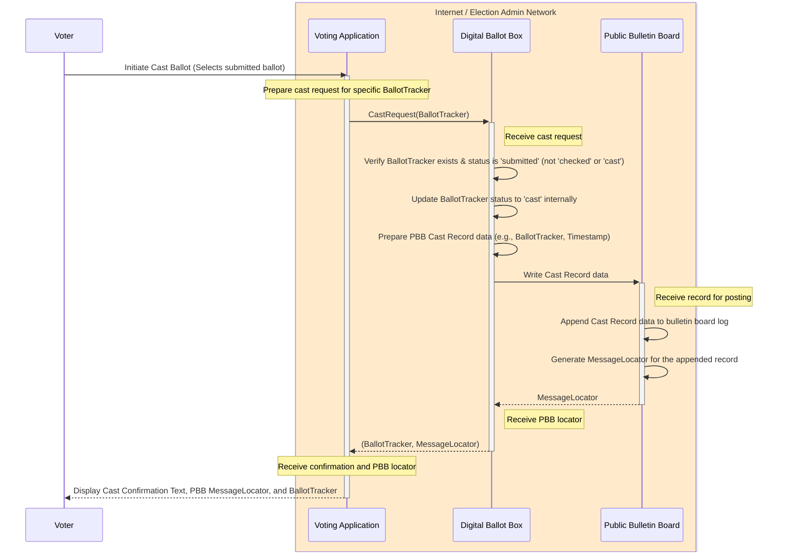

# Ballot Cast Subprotocol Sequence Diagram

```mermaid
sequenceDiagram
    participant Voter

    box rgb(255, 235, 204) Internet / Election Admin Network
        participant VA as Voting Application
        participant DBB as Digital Ballot Box
        participant PBB as Public Bulletin Board
    end

    Voter ->> VA: Initiate Cast Ballot (Selects submitted ballot)
    activate VA
    Note over VA: Prepare cast request for specific BallotTracker

    VA ->> +DBB: CastRequest(BallotTracker) # Send request to DBB

    Note right of DBB: Receive cast request
    DBB->>DBB: Verify BallotTracker exists & status is 'submitted' (not 'checked' or 'cast')
    DBB->>DBB: Update BallotTracker status to 'cast' internally
    DBB->>DBB: Prepare PBB Cast Record data (e.g., BallotTracker, Timestamp)
    DBB ->> +PBB: Write Cast Record data # Post evidence to PBB

    Note right of PBB: Receive record for posting
    PBB->>PBB: Append Cast Record data to bulletin board log
    PBB->>PBB: Generate MessageLocator for the appended record
    PBB -->> -DBB: MessageLocator # Return locator confirming PBB post

    Note right of DBB: Receive PBB locator
    DBB -->> -VA: (BallotTracker, MessageLocator) # Confirm cast to VA, include locator

    Note over VA: Receive confirmation and PBB locator
    VA -->> Voter: Display Cast Confirmation Text, PBB MessageLocator, and BallotTracker
    deactivate VA
```
