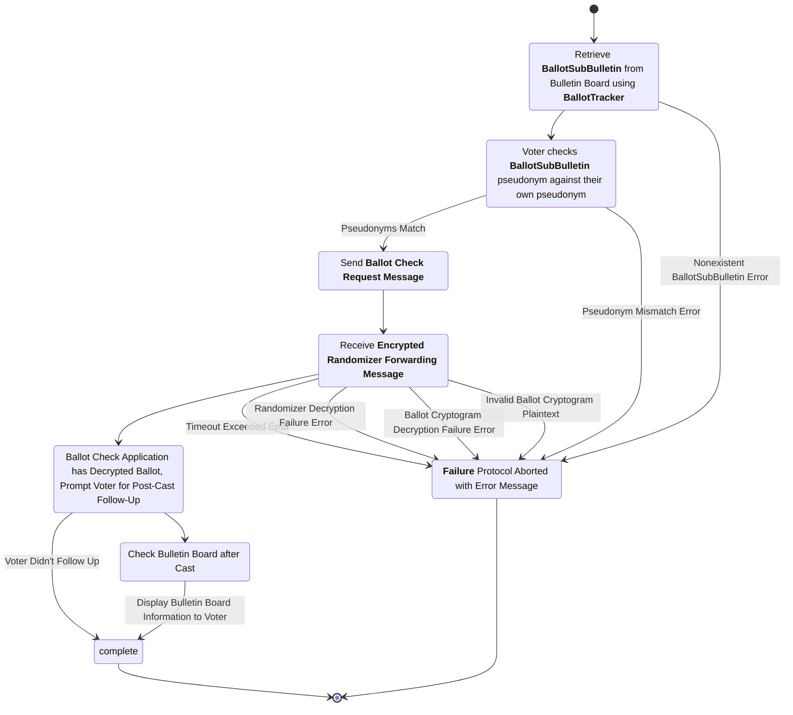
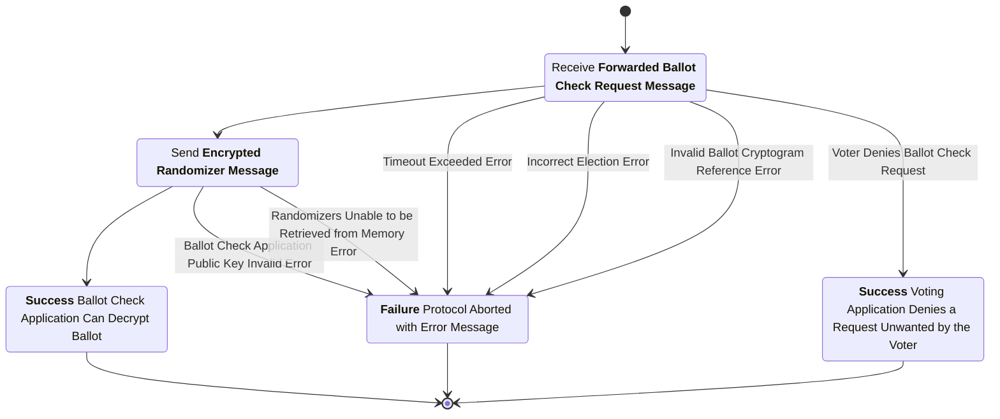
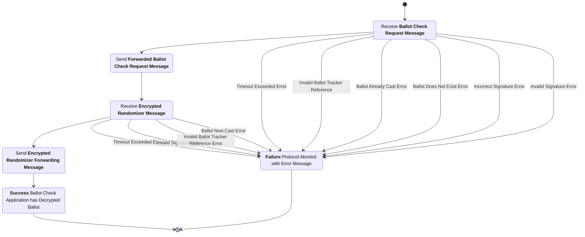

# Ballot Check Subprotocol

This subprotocol covers the process where the Ballot Check Application (BCA) interacts with the Voting Application to first authenticate itself and then confidentially retrieve the randomizers used to encrypt the ballot. This allows the Ballot Check Application to decrypt the encrypted and signed ballot posted to the Public Bulletin Board presenting the decrypted plaintext to the voter for manual verification of voter intent. Note that the BCA receives the tracker for the submitted ballot on the public bulletin board out-of-band, via manual user input as part of initiating the checking process, and also prompts the voter to compare the pseudonym of the submitted ballot (after retrieving it from the public bulletin board) out-of-band. A properly implemented BCA will not initiate the protocol with the DBB if the voter indicates that the pseudonyms do not match, but will instead report an error.

## Phase 1: Authenticate and Request

### Ballot Check Request Message

sender
: Ballot Check Application (BCA)

recipient
: Digital Ballot Box (DBB)

purpose
: Communicate to the VA the BCA's request to check a certain ballot. The DBB serves as an intermediary due to the challenges facing directly connecting two client devices across any possible network configuration. Importantly, the BCA embeds its public key both as an identifier for the voter to manually compare as an authentication mechanism and as a way to allow for the VA to establish confidential communication with the BCA.

***structure***

```rust
struct CheckReqMsgData {
  election_hash : ElectionHash,
  tracker : BallotTracker,
  public_enc_key : ElectionKey,
  public_sign_key : VerifyingKey,
}

struct CheckReqMsg {
  data : CheckReqMsgData,
  signature : Signature,
}
```

- `election_hash`: The hash of the unique election configuration item.
- `tracker`: The unique identifier corresponding to the ballot submission bulletin entry on the bulletin board containing the ballot being requested for checking.
- `public_enc_key`: The public encryption key generated by the BCA.
- `public_sign_key`: The public signing key generated by the BCA.
- `data`: The data being signed (contains the election hash, tracker, public encryption key, and public signing key).
- `signature`: A digital signature created over the serialized contents of the `data` field by the BCA's signing key.

### Ballot Check Request Checks

1. The `election_hash` is the hash of the election configuration item for the current election.
2. The `tracker` corresponds to a valid *Ballot Submission Bulletin* entry on the public bulletin board.
3. The `public_enc_key` and `public_sign_key` are valid public keys for their respective cryptosystems.
4. The `signature` is a valid signature by the `public_sign_key` over the serialized contents of the `data` field.

### Forwarded Ballot Check Request Message

sender
: Digital Ballot Box (DBB)

recipient
: Voting Application (VA)

purpose
: To transmit the BCA's ballot check request to the VA after the DBB performs validation. This serves to limit the abuse possible by an adversary making repeated forged requests. Importantly, the DBB also signs this message asserting the DBB has performed validation allowing the VA to verify and accept requests that have also been approved by the DBB.

***structure***

```rust
struct FwdCheckReqMsgData {
  election_hash : ElectionHash,
  message : CheckReqMsg,
}

struct FwdCheckReqMsg {
  data : FwdCheckReqMsgData,
  signature : Signature,
}
```

- `election_hash`: The hash of the unique election configuration item.
- `message`: The check request message being forwarded.
- `data`: The data being signed (contains the election hash and the check request message).
- `signature`: A digital signature created over the serialized contents of the `data` field by the digital ballot box's signing key.

### Forwarded Ballot Check Request Checks

1. The `election_hash` is the hash of the election configuration item for the current election.
2. The `message` is a valid *Ballot Check Request Message*.
3. The `signature` is a valid signature by the digital ballot box signing key over the serialized contents of the `data` field.

## Phase 2: Randomizer Transmission

### Encrypted Randomizer Message

sender
: Voting Application (VA)

recipient
: Digital Ballot Box (DBB)

purpose
: Communicate the ciphertext of the randomizers (encrypted for the BCA public key) to the DBB so that the DBB can forward the ciphertext to the BCA. This occurs only after the VA validates the request and presents the public key of the BCA to the voter for a visual comparison with the public key displayed on the BCA as the authentication mechanism.

***structure***

```rust
struct RandomizerMsgData {
  election_hash : ElectionHash,
  message : CheckReqMsg,
  encrypted_randomizers : RandomizersCryptogram,
  public_key : VerifyingKey,
}

struct RandomizerMsg {
  data : RandomizerMsgData,
  signature : Signature,
}

struct RandomizersCryptogram {
  ballot_style : BallotStyle,
  ciphertext : RandomizerCiphertext,
}
```

- `election_hash`: The hash of the unique election configuration item.
- `message`: The check request message this encrypted randomizers cryptogram intends to satisfy.
- `encrypted_randomizers`: The cryptogram containing randomizers encrypted using the BCA public encryption key.
- `public_key`: The public signing key generated by the VA.
- `data`: The data being signed (contains the election hash, message, encrypted randomizers, and public key).
- `signature`: A digital signature created over the serialized contents of the `data` field by the VA's signing key.
- `ballot_style`: The ballot style identifier for the randomizers cryptogram.
- `ciphertext`: The Naor-Yung ciphertext containing the encrypted randomizers.

### Encrypted Randomizer Checks

1. The `election_hash` is the hash of the election configuration item for the current election.
2. The `message` is a valid *Ballot Check Request Message*.
3. Each ciphertext in the `encrypted_randomizers` list is a valid Naor-Yung ciphertext.
4. The `encrypted_randomizers` list is equal in length to the number of items in the ballot style of the `tracker` in the `message`.
5. The `public_key` matches the `public_key` in the *Ballot Submission Bulletin* corresponding to the `tracker` in the `message`.
6. The `signature` is a valid signature over the serialized contents of the `data` field signed by the `public_key`.

### Encrypted Randomizer Forwarding Message

sender
: Digital Ballot Box (DBB)

recipient
: Ballot Check Application (BCA)

purpose
: To forward along the ciphertext containing the randomizers used for the ballot being checked. The DBB only forwards this message along after verifying it is being sent by the VA who cast the ballot being checked.

***structure***

```rust
struct FwdRandomizerMsgData {
  election_hash : ElectionHash,
  message : RandomizerMsg,
}

struct FwdRandomizerMsg {
  data : FwdRandomizerMsgData,
  signature : Signature,
}
```

- `election_hash`: The hash of the unique election configuration item.
- `message`: The randomizer transmission message being forwarded.
- `data`: The data being signed (contains the election hash and the randomizer message).
- `signature`: A digital signature created over the serialized contents of the `data` field by the digital ballot box's signing key.

### Encrypted Randomizer Forwarding Checks

1. The `election_hash` is the hash of the election configuration item for the current election.
2. The `message` is a valid *Encrypted Randomizer Forwarding Message*.
3. The `signature` is a valid signature by the digital ballot box signing key over the serialized contents of the `data` field.

## Phase 3: Decryption and Comparison

The BCA uses its private key to decrypt the ciphertext containing the randomizers. The BCA uses the plaintext randomizers to decrypt the plaintext ballot selections. These plaintext ballot selections are presented to the user using the display of the BCA for a manual check of voter intent. The BCA then prompts to voter to press a button (or other control) to indicate whether they cast or do not cast the ballot in the voting application, so it can check the bulletin board to show the voter either that the correct ballot has been cast, or that no ballot has been cast.

## Ballot Check Application Process Diagram



## Voting Application Process Diagram



## Digital Ballot Box Process Diagram


