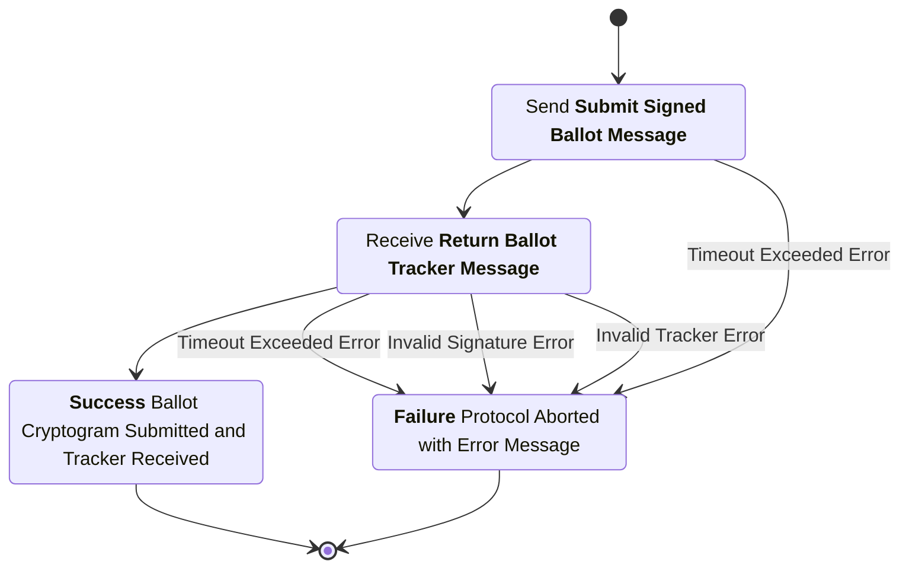
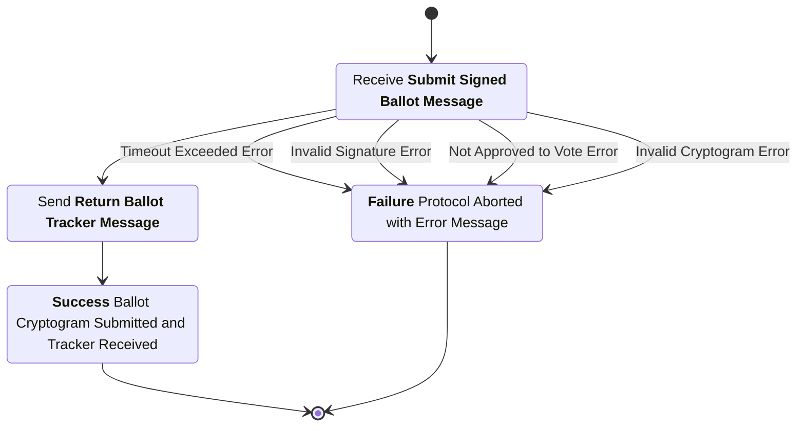

# Ballot Submission Subprotocol

This subprotocol covers the process where the Voting Application sends the encrypted and signed ballot to the Digital Ballot Box, which verifies it, records it on the Public Bulletin Board, and returns a tracker.

## Phase 1: Ballot Preparation and Submission

### Ballot Preparation (Internal VA Process)

Before sending the ballot, the Voting Application performs the necessary cryptographic operations internally. For each choice the voter made:

1. The application maps the choice to its corresponding plaintext representation (m) based on the Election Manifest.
2. It generates a unique randomizer (r).
3. It encrypts the plaintext using Naor-Yung with the Election Public Key (Y) and the randomizer (r) to produce the ciphertext pair (c1, c2, pi).
4. These ciphertext pairs are collected, along with their associated contest identifiers, into a list structure representing the encrypted ballot.
5. Finally, the application signs this entire list structure (*ballot_cryptogram*) using its session-specific signing key corresponding to the (*voter_verifying_key*) generated during authentication.

### Submit Signed Ballot Message

sender
: Voting Application (VA)

recipient
: Digital Ballot Box (DBB)

purpose
: This message submits to the digital ballot box a signed ballot cryptogram encrypted for the election public key.

***structure***

```rust
struct SignedBallotMsgData {
  election_hash : ElectionHash,
  voter_pseudonym : VoterPseudonym,
  voter_verifying_key : VerifyingKey,
  ballot_style : BallotStyle,
  ballot_cryptogram : BallotCryptogram,
}

struct SignedBallotMsg {
  data : SignedBallotMsgData,
  signature : Signature,
}

struct BallotCryptogram {
  ballot_style : BallotStyle,
  ciphertext : BallotCiphertext,
}
```

- `election_hash`: The hash of the unique election configuration item.
- `voter_pseudonym`: The unique identifier for the voter.
- `voter_verifying_key`: The verifying key associated with this voting session.
- `ballot_style`: The identifier for this unique ballot style.
- `ballot_cryptogram`: The ballot cryptogram containing the encrypted ballot ciphertext.
- `data`: The data being signed (contains the election hash, voter pseudonym, voter verifying key, ballot style, and ballot cryptogram).
- `signature`: A digital signature created over the serialized contents of the `data` field by the signing key corresponding to the authorized voter verifying key.
- `ciphertext`: The Naor-Yung ciphertext containing the encrypted ballot.

channel properties
: The `signature` provides *integrity* and *authenticity* for the contents of the message. The `BallotCryptogram` ciphertexts provide confidentiality for the plaintext contest choices of the voter's ballot.

## Phase 2: Verification and Recording

### Submit Signed Ballot Checks

1. The `election_hash` is the hash of the election configuration item for the current election.
2. The `voter_pseudonym` and `voter_verifying_key` match a stored `AuthVoterMsg` from the EAS.
3. The `ballot_style` is a valid ballot style for this election.
4. The `ballot_style` matches the `AuthVoterMsg` from check #2.
5. The list of `contest_id` in the `BallotCryptograms` in the `cryptogram_list` match the structure of the `ballot_style`.
6. The `signature` is a valid signature over the serialized contents of the `data` field signed by the signing key corresponding to `voter_verifying_key`.
7. All `pi` Naor-Yung proofs verify correctly for the entire `cryptogram_list` list of `BallotCryptogram`s.
8. All `c1` and `c2` ciphertext components are encryptions for the public election key for the entire `cryptogram_list` list of `BallotCryptogram`s.
9. The ciphertext does not already exist on the bulletin board.

### Ballot Submission Bulletin

Once the *Submit Signed Ballot Checks* have been completed successfully, the digital ballot box appends this entry to the public bulletin board. This entry serves to permanently record the submission of a ballot cryptogram using a tamper evident data structure.

***structure***

```rust
struct BallotSubBulletinData {
  election_hash : ElectionHash,
  timestamp : u64,
  ballot : SignedBallotMsg,
  previous_bb_msg_hash : String,
}

struct BallotSubBulletin {
  data : BallotSubBulletinData,
  signature : String,
}
```

- `election_hash`: The hash of the unique election configuration item.
- `timestamp`: The timestamp of when the DBB processed the submission (Unix timestamp in seconds since epoch).
- `ballot`: The signed ballot message submitted earlier in full.
- `previous_bb_msg_hash`: The hash of the last message posted to the bulletin board.
- `data`: The data being signed (contains the election hash, timestamp, ballot, and previous bulletin board message hash).
- `signature`: A digital signature created over the serialized contents of the `data` field by the digital ballot box signing key.

## Phase 3: Confirmation

### Ballot Tracker Calculation (Internal DBB Process)

The DBB calculates the Ballot Tracker by taking a cryptographic hash of the entire PBB Ballot Submission Message exactly as it was written to the PBB.

### Return Ballot Tracker Message

sender
: Digital Ballot Box (DBB)

recipient
: Voting Application (VA)

purpose
: This message confirms successful submission of the ballot and provides the hash of the public bulletin board message which uniquely identifies this record on the public bulletin board.

***Structure***

```rust
struct TrackerMsgData {
  election_hash : ElectionHash,
  tracker : Option<BallotTracker>,
  submission_result : (bool, String),
}

struct TrackerMsg {
  data : TrackerMsgData,
  signature : Signature,
}
```

- `election_hash`: The hash of the unique election configuration item.
- `tracker`: The optional ballot tracker (hash of the BallotSubBulletin), present only if submission succeeded.
- `submission_result`: A tuple containing a boolean indicating if the submission was successful and a string with result details.
- `data`: The data being signed (contains the election hash, tracker, and submission result).
- `signature`: A digital signature created over the serialized contents of the `data` field by the digital ballot box signing key.

channel properties
: The `signature` provides *integrity* and *authenticity* for the contents of the message.

### Return Ballot Tracker Checks

1. The `election_hash` is the hash of the election configuration item for the current election.
2. If `tracker` is present, it corresponds to a `BallotSubBulletin` on the public bulletin board which contains the previously submitted `SignedBallotMsg`.
3. The `signature` is a valid signature over the serialized contents of the `data` field by the digital ballot box signing key.

### Confirmation Handling (Internal VA Process)

The VA receives the Return Ballot Tracker Message and stores the ballot_tracker. This tracker is then shown to the voter.

## Voting Application Process Diagram



## Digital Ballot Box Process Diagram


