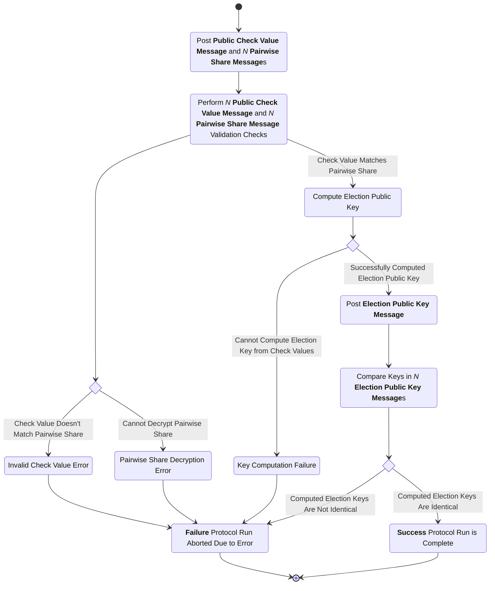
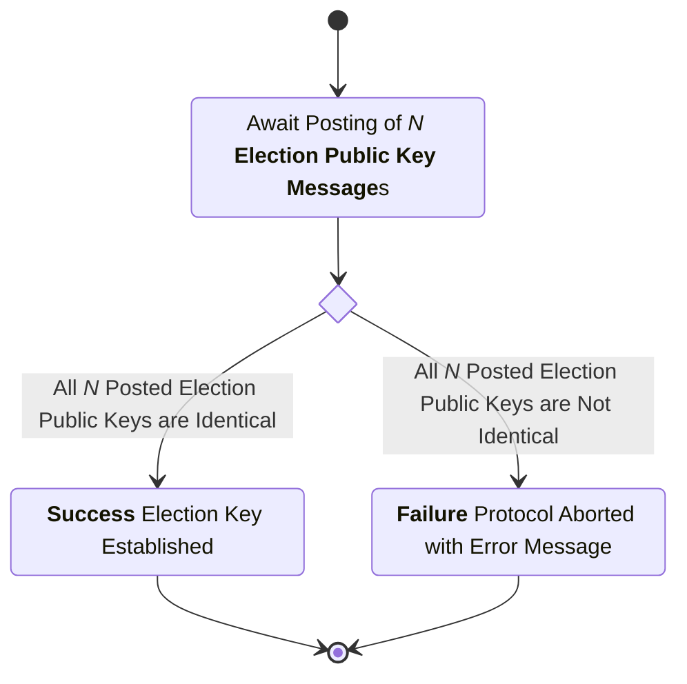

# Election Key Generation Subprotocol

This subprotocol defines the interactions between the trustees and the trustee administration server (TAS) to accomplish the distributed generation of a public key with each trustee holding a private key share. When ballots are later encrypted they are encrypted using this election public key.

## Trustee Protocol Communication

In this trustee protocol (and all subsequent ones) the TAS performs minimal computation, and exists primarily to provide a "trustee board" on which the trustees can post protocol messages. The trustee board is similar to a public bulletin board, but the messages are not stored in a chain-like structure; instead, there is a fixed set of "message slots" (or "message identifiers"), each of which is used at a specific point in the protocol, and each of which (in a successful run of the protocol) can only be used once. The messages on the trustee board are stored in chronological order based on when the TAS receives them. Each trustee `t` maintains its own local copy of the trustee board by asking the TAS for all the messages later than the last message `t` has seen, whenever `t` has no messages to process in its current state. In this way every local copy of the trustee board necessarily _follows_ the board stored in the TAS; the TAS board is a sequence of messages `S`, and every local trustee board is a monotonically nondecreasing prefix of `S`.

All protocol messages are signed with trustee keys, and the trustee public keys are known a priori to all trustees and to the TAS at the beginning of this protocol (becuase of prior trustee setup). The TAS ensures that only messages signed by trustees that it knows to be part of the protocol are posted to the trustee board, but does _not_ do any checking of message contents or message slots (note that this is an optimization; we could delegate all the signature checking to the trustees in an implementation, but then the trustee board would be subject to containing trivially invalid messages). It is therefore possible for a message slot to be used more than once on the TAS board, but this is easily detected by honest trustees: if an honest trustee ever receives a message for a slot that is already filled, it stops execution and declares that the protocol has failed. It does the same if it ever receives a messsage signed with its own private key that it did not previously send, indicating a key compromise.

This trustee board update method assumes that the TAS maintains a consistent trustee board, honestly posts messages that are signed by trustees, and honestly updates all the trustees upon request. If it doesn't, its corruption is either (1) detectable by at least one honest trustee that receives data it does not expect at some stage of the protocol, or (2) detectable because the protocol fails to complete when a trustee does not receive some protocol message that was posted by another trustee. Trustee board corruption that is not detectable in one of these two ways has no effect on the outcome of the protocol.

An implementation could eliminate these assumptions on the TAS by making the trustees use some peer-to-peer consensus mechanism to synchronize their local boards (with or without any central TAS board). However, the TAS is also the entry point that provides all election data, including the election setup, ballot cryptograms, etc., to the trustee protocols; if it is corrupted in a way such that it does not properly maintain the trustee board, it also can't be trusted to honestly provide the other information.

In the following protocol phase descriptions, all messages are posted to the trustee board. In the message descriptions, **recipient** means "the trustee that is supposed to read and act upon the message", not "the trustee that receives the message" (all trustees eventually receive all posted messages on their local copies of the trustee board), and **board slot** means "the message fields that determine the trustee board slot filled by the message." All integrity checks described for the messages are performed by the trustees; additionally, the TAS performs the public signing key and signature checks to prevent unsigned or badly signed messages from being posted to the trustee board.

In addition to the explicit integrity checks listed with each message type, each trustee continuously (i.e., every time it receives a trustee board update) checks that no trustee board slot contains more than one message. If this check or any explicit message integrity check ever fails, the trustee _immediately_ stops participating in the subprotocol and raises an alarm (out of band) to the other trustees and the election authority that something has gone wrong and must be resolved manually before the subprotocol can be re-attempted.

## Phase 1: Trustees Post Public Check Values and Encrypted Private Shares

In this phase of the subprotocol, each trustee posts `N + 1` messages to the bulletin board, where `N` is the total number of trustees. One of these messages is the trustee's vector of public check values, and the other `N` are the pairwise secret shares it creates for all the trustees (including itself). The public check values are used both to check the validity of the private shares and to generate the election public key.

Note that an implementation of the protocol might choose to combine these `N + 1` messages into a single message containing a vector of public check values and a vector of encrypted pairwise shares; this simplifies the messaging (by reducing the number of messages) at the cost of increasing the complexity of message encoding/decoding. This choice does not affect the behavior of the protocol, aside from making the combined message from each trustee take a single board slot instead of the `N + 1` board slots taken by the individual public check value and pairwise share messages.

### Key Shares Message

sender
: Trustee

recipient
: All Trustees

board slot
: (`originator`, `signer`)

purpose
: Post a single trustee's public check values and pairwise shares for all trustees.

_**structure**_

```rust
struct KeySharesMsgData {
    originator : TrusteeID,
    signer : TrusteeID,
    election_hash : ElectionHash,
    check_values : Vec<CheckValue>,
    pairwise_shares : Vec<ShareCiphertext>,
}

struct KeySharesMsg {
    data : KeySharesMsgData,
    signature : Signature,
}
```

- `originator`: The trustee ID (name and verifying key) that originated this message.
- `signer`: The trustee ID (name and verifying key) that signed this message (same as originator for initial posting).
- `election_hash`: The hash of the unique election configuration item.
- `check_values`: The public check values computed by the trustee (one for each trustee in the same order as the trustees list from setup).
- `pairwise_shares`: The pairwise shares computed by the trustee for all trustees (encrypted to each recipient's public encryption key, in the same order as the trustees list from setup).
- `data`: The data being signed (contains originator, signer, election hash, check values, and pairwise shares).
- `signature`: A digital signature created over the serialized contents of the `data` field.

channel properties
: The encryption of the pairwise shares and the `signature` are intended to provide integrity, authenticity, and confidentiality over the pairwise shares. The `signature` is also intended to provide integrity and authenticity over the entire message.

#### Key Shares Message Integrity Checks

1. The `election_hash` is the hash of the election configuration item for the current election.
2. The `check_values` are valid with respect to the pairwise shares generated by the sending trustee.
3. The `originator` and `signer` are valid trustee IDs for a trustee in this election.
4. The `signature` is a valid signature matching the `signer.verifying_key` over the serialized contents of the `data` field.

## Phase 2: Post the Election Public Key

In this phase of the subprotocol, each trustee independently computes the election public key from the public check values and posts it to the trustee board. If the subprotocol is successful, this results in `N` identical (aside from their signatures/sender keys) election public key messages on the board.

Note that the trustees can not successfully carry out this phase if any integrity check from the previous phase failed, because any trustee observing a failed integrity check immediately aborts the subprotocol (as described previously).

### Election Public Key Message

sender
: Trustee

recipient
: All Trustees

board slot
: (`message_type`, `public_key`)

purpose
: Publish the election public key computed by the trustee (for comparison with the election public keys computed by the other trustees).

_**structure**_

```rust
struct ElectionPublicKeyMsgData {
    originator : TrusteeID,
    signer : TrusteeID,
    election_hash : ElectionHash,
    election_public_key : ElectionKey,
}

struct ElectionPublicKeyMsg {
    data : ElectionPublicKeyMsgData,
    signature : Signature,
}
```

- `originator`: The trustee ID (name and verifying key) that originated this message.
- `signer`: The trustee ID (name and verifying key) that signed this message (same as originator for initial posting).
- `election_hash`: The hash of the unique election configuration item.
- `election_public_key`: The election public key computed by this trustee.
- `data`: The data being signed (contains originator, signer, election hash, and election public key).
- `signature`: A digital signature created over the serialized contents of the `data` field.

channel properties
: The `signature` is intended to provide integrity and authenticity over the election public key.

### Election Public Key Message Checks

1. The `election_hash` is the hash of the election configuration item for the current election.
2. The `election_public_key` is identical to the `election_public_key`s posted by all the other trustees (this includes the trustee performing the message check) in their election public key messages.
3. The `public_key` is a valid signing key for a trustee in this election.

## Termination

The subprotocol successfully terminates when one **Election Public Key Message** has posted by each trustee and all those messages contain identical election public keys. At that point, the trustees have all agreed upon the election public key, and the trustee administration server can add it to the election configuration that gets posted to the public bulletin board.

## Process Diagrams

### Trustee Process Diagram



### Trustee Administration Server Process Diagram

Note that this does not include the the process diagram for the TAS updating trustees with the latest trustee board messages, or accepting messages for posting. The mechanism for that is implementation-dependent and different implementations may exhibit different communication patterns for trustee board updates.


