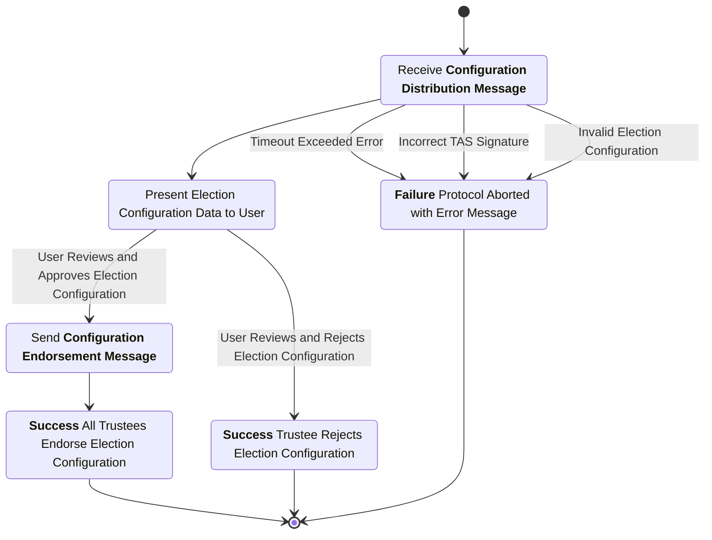
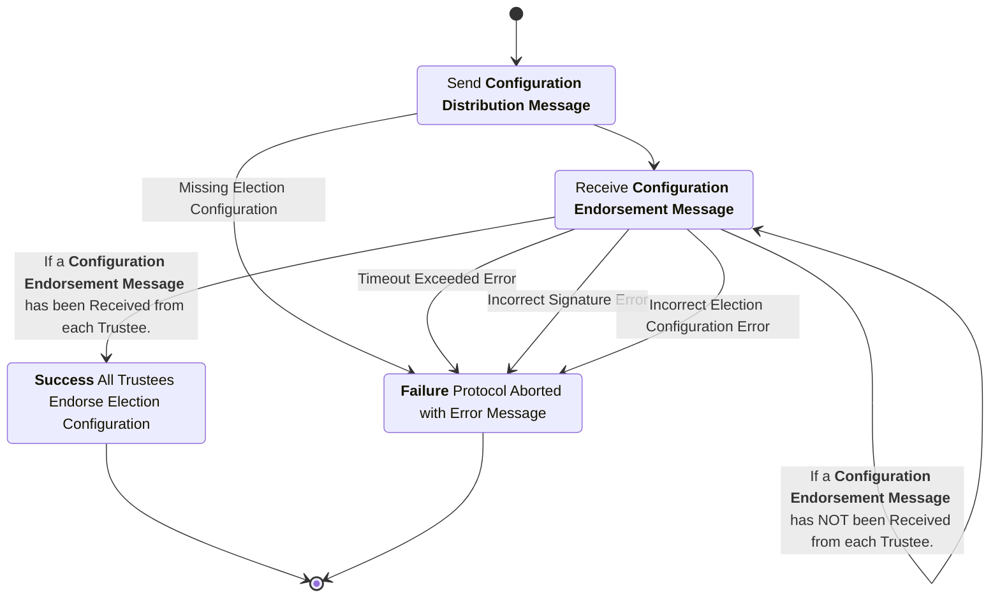

# Setup Subprotocol Specification

This subprotocol defines the interactions among the trustees and the trustee administration server to initialize the voting protocol. The purpose of this subprotocol is for all trustees to endorse an official configuration of the protocol for a particular election. This configuration includes the list of trustees and their associated public keys thereby establishing PKI for the Trustees.

## Phase 1: Configuration Distribution

In this phase the configuration for the election is distributed to each trustee for their inspection.

### Configuration Distribution Message

sender
: Trustee Administration Server (TAS)

recipient
: Trustee

purpose
: Transmit the proposed election configuration from the Trustee Administration Server to a Trustee.

***structure***

```rust
struct SetupMsgData {
    originator : TrusteeID,
    signer : TrusteeID,
    manifest : String,
    threshold : u32,
    trustees : Vec<TrusteeInfo>,
}

struct SetupMsg {
    data : SetupMsgData,
    signature : Signature,
}

struct TrusteeID {
    name : String,
    verifying_key : VerifyingKey,
}

struct TrusteeInfo {
    name : String,
    verifying_key : VerifyingKey,
    public_enc_key : TrusteePublicKey,
}
```

- `originator`: The trustee ID (name and verifying key) that originated this message (the TAS).
- `signer`: The trustee ID (name and verifying key) that signed this message.
- `manifest`: The election manifest (encoding is implementation-dependent).
- `threshold`: The trustee threshold for the distributed key generation.
- `trustees`: The list of trustees participating in this election (includes the TAS as the first entry).
- `data`: The data being signed (contains originator, signer, manifest, threshold, and trustees list).
- `signature`: A digital signature created over the serialized contents of the `data` field.
- `name`: The human-readable name for the trustee or TAS.
- `verifying_key`: The public signing key for the trustee or TAS.
- `public_enc_key`: The public encryption key for the trustee.

channel properties
: The signature by the TAS included in this message serves to provide authenticity and integrity for the transmitted election configuration.

## Phase 2: Configuration Acceptance

In this phase, each trustee reviews the configuration and, if acceptable, signs the same `SetupMsg` (with their own trustee ID as the `signer`) and returns it to the TAS. This provides a public endorsement of the election configuration.

### Configuration Endorsement Message

sender
: Trustee

recipient
: Trustee Administration Server (TAS)

purpose
: Sign the election configuration as a public endorsement by the trustee signing the message. Included in this is the list of trustees and their associated public keys thereby providing a root to the public key infrastructure among the trustees. Notably, the identities of the other trustees and their associated public keys should be confirmed out of band before this message is signed and sent.

***structure***

The trustee sends back a `SetupMsg` with the same structure as the Configuration Distribution Message, but with:

- The `signer` field set to the trustee's own ID (name and verifying key)
- The `signature` created by the trustee's signing key over the serialized contents of the `data` field

```rust
struct SetupMsgData {
    originator : TrusteeID,
    signer : TrusteeID,
    manifest : String,
    threshold : u32,
    trustees : Vec<TrusteeInfo>,
}

struct SetupMsg {
    data : SetupMsgData,
    signature : Signature,
}
```

- The `originator` remains the TAS's trustee ID
- The `signer` is the endorsing trustee's ID (name and verifying key)
- All other fields (`manifest`, `threshold`, `trustees`) must be identical to the Configuration Distribution Message
- The `signature` is created over the serialized contents of the `data` field by the endorsing trustee's signing key

channel properties
: The signature by the trustee included in this message serves as an endorsement of the election configuration with non-repudiation of the endorsement along with integrity over the election configuration and authenticity with respect to who is endorsing this election configuration.

## Trustee Process Diagram



## Trustee Administration Server Process Diagram


