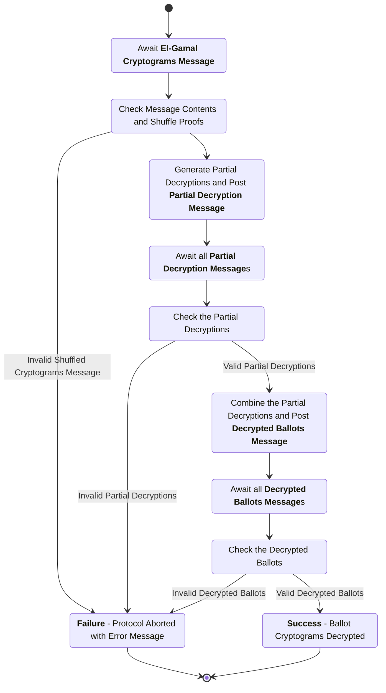
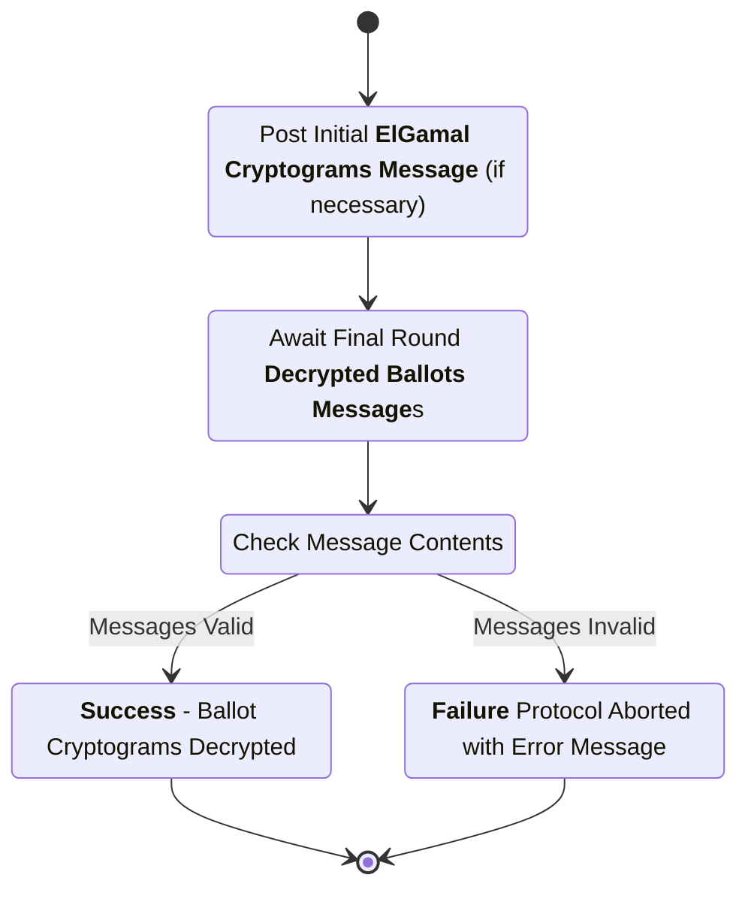

# Trustee Decryption Subprotocol

This subprotocol specifies the interactions between the trustees and the trustee administration server (TAS) that transform the (already mixed) list of ballot ciphertexts into a list of plaintexts to be tallied.

## Trustee Protocol Communication

As with the election key generation and trustee mixing protocols, the TAS performs minimal computation in this protocol. It performs three main functions: providing a "trustee board" on which the trustees can post protocol messages; validating the final round of messages posted by the trustees at the end of the subprotocol before printing them or writing them to a storage device for later printing by the election administrator; and (if necessary) posting an initial message to the trustee board containing the set of encrypted ballots that needs to be decrypted.

More information on the trustee board mechanism is avaiable in the [election key protocol specification](./election-key-gen-spec.md).

We assume that this subprotocol starts in one of two ways: (1) trustee computation picks up where the trustee mixing subprotocol left off, with the same trustee board, such that the messages from the final round of the trustee mixing subprotocol are already on the board; or (2) the TAS initializes the trustee board to contain either all, or only the last round of, the mixing subprotocol messages. In either event, the trustees start from `K` **ElGamal Cryptograms Message**s with the same `original_message_source` (the trustee that shuffled last), identical aside from signatures and signing trustee public keys. For efficiency, if the mixing and decryption subprotocols take place at different times or in different places, an implementation might choose to coalesce these `K` messages into a single message similar to the **Initial Cryptograms Message** in the trustee mixing subprotocol, but containing all the trustee public keys and signatures for the final mix. We do not describe the format of such a coalesced message here.

In this subprotocol, the trustees need to wait for messages from all participating trustees before proceeding. This implies that the trustees know the entire set of participating trustees, and that the set of participating trustees cannot change _during_ the protocol execution without causing the protocol to fail. The set of participating trustees is provided to all the participating trustees either out of band, or as part of an initial protocol message posted by the TAS.

## Phase 1: Post Partial Decryptions

In this phase, all participating trustees perform their own partial decryptions of the mixed ballot cryptograms and post their results to the trustee board. They perform the same message checks on the initial **ElGamal Cryptograms Message**s that they would perform to conclude a round of the trustee mixing subprotocol. These checks can be skipped if the same set of participating trustees executes this subprotocol immediately after the trustee mixing subprotocol, because they will have already performed it; however, if the set of participating trustees is different, they should perform the checks again.

### ElGamal (EG) Cryptograms Message

sender
: All Participating Trustees from Mixing Subprotocol, or TAS

recipient
: All Participating Trustees

board slot
: (`message_type`, `source_trustee`, `public_key`)

purpose
: Post a initial shuffled list of ElGamal cryptograms and corresponding shuffle proofs (from the mixing subprotocol).

_**structure**_

```rust
struct EGCryptogramsMsgData {
    originator : TrusteeID,
    signer : TrusteeID,
    election_hash : ElectionHash,
    ciphertexts : BTreeMap<BallotStyle, Vec<StrippedBallotCiphertext>>,
    proofs : BTreeMap<BallotStyle, MixRoundProof>,
}

struct EGCryptogramsMsg {
    data : EGCryptogramsMsgData,
    signature : Signature,
}
```

- `originator`: The trustee ID (name and verifying key) that performed the shuffle to generate the list of ciphertexts and proofs in this message.
- `signer`: The trustee ID (name and verifying key) of the trustee signing this message.
- `election_hash`: The hash of the unique election configuration item.
- `ciphertexts`: A map from ballot styles to lists of shuffled stripped ballot ciphertexts.
- `proofs`: A map from ballot styles to mix round proofs corresponding to the ciphertexts.
- `data`: The data being signed (contains originator, signer, election hash, ciphertexts, and proofs).
- `signature`: A digital signature created over the serialized contents of the `data` field by the signing key corresponding to `signer.verifying_key`.

channel properties
: The `signature` is intended to provide authenticity and integrity over the message contents.

### ElGamal Cryptograms Message Checks

1. The `election_hash` is the hash of the election configuration item for the current election.
2. The `originator` is a valid trustee for this election.
3. The `ciphertexts` map contains ballot styles and lists of stripped ballot ciphertexts valid for this election.
4. The `ciphertexts` map is identical to the `ciphertexts` map in every other `EGCryptogramsMsg` with the same `originator`.
5. The `proofs` map contains valid mix round proofs for the corresponding `ciphertexts` lists.
6. The `signer` is a valid trustee ID for a trustee in this election.
7. The `signature` is a valid signature matching the `signer.verifying_key` over the serialized contents of the `data` field.

### Partial Decryption Message

sender
: Participating Trustee

recipient
: All Participating Trustees

board slot
: (`message_type`, `public_key`)

purpose
: Post the trustee's partial decryptions so that the other trustees can validate them.

_**structure**_

```rust
struct PartialDecryptionsMsgData {
    originator : TrusteeID,
    signer : TrusteeID,
    election_hash : ElectionHash,
    partial_decryptions : BTreeMap<BallotStyle, Vec<PartialDecryption>>,
}

struct PartialDecryptionsMsg {
    data : PartialDecryptionsMsgData,
    signature : Signature,
}

struct PartialDecryption {
    decrypted_component : TrusteePublicKey,
    proof : DecryptionProof,
}
```

- `originator`: The trustee ID (name and verifying key) that originated this message (the trustee that performed these partial decryptions).
- `signer`: The trustee ID (name and verifying key) that signed this message (same as originator for initial posting).
- `election_hash`: The hash of the unique election configuration item.
- `partial_decryptions`: A map from ballot styles to lists of partial decryptions (and their proofs) generated by the trustee.
- `data`: The data being signed (contains originator, signer, election hash, and partial decryptions).
- `signature`: A digital signature created over the serialized contents of the `data` field by the signing key corresponding to `signer.verifying_key`.
- `decrypted_component`: The partially decrypted component.
- `proof`: The proof of correct partial decryption.

channel properties
: The `signature` is intended to provide authenticity and integrity over the message contents.

### Partial Decryption Message Checks

1. The `election_hash` is the hash of the election configuration item for the current election.
2. The `partial_decryptions` list contains a well formed partial decryption for each ciphertext in the list of cryptograms being decrypted, and each partial decryption proof verifies correctly.
3. The `signer` is a valid trustee ID for a trustee participating in this subprotocol.
4. The `signature` is a valid signature matching the `signer.verifying_key` over the serialized contents of the `data` field.

## Phase 2: Partial Decryption Verification and Combination

In this phase, each trustee waits for all participating trustees to post partial decryption messages, and performs the `PartialDecryptionsMessage` checks on all of them. If all these checks succeed, the trustee combines the partial decryptions and posts them to the trustee board.

At the end of a successful phase 2, there are `K` messages with identical content (aside from signing trustee key and signature) on the trustee board containing the decrypted list of cryptograms. When this occurs, and the messages pass all the checks listed below, the decryption subprotocol is complete. If the messages do not pass the checks, or do not have identical content, the decryption subprotocol fails. This validation of the decrypted ballots does not result in any protocol messages, as the success or failure of the protocol is self-evident from whether the lists of decrypted ballots in the `DecryptedBallotMessage`s are identical; it does, however, allow trustees to report that failure if the TAS does not detect it.

### Decrypted Ballots Message

sender
: Participating Trustee

recipient
: All Participating Trustees

board slot
: (`message_type`, `public_key`)

purpose
: Post the trustee's partial decryptions so that the other trustees can validate them.

```rust
struct DecryptedBallotsMsgData {
    originator : TrusteeID,
    signer : TrusteeID,
    election_hash : ElectionHash,
    decrypted_ballots : BTreeMap<BallotStyle, Vec<DecryptedBallot>>,
}

struct DecryptedBallotsMsg {
    data : DecryptedBallotsMsgData,
    signature : Signature,
}
```

- `originator`: The trustee ID (name and verifying key) that originated this message (the trustee that combined the partial decryptions).
- `signer`: The trustee ID (name and verifying key) that signed this message (same as originator for initial posting).
- `election_hash`: The hash of the unique election configuration item.
- `decrypted_ballots`: A map from ballot styles to lists of decrypted ballots generated by combining partial decryptions.
- `data`: The data being signed (contains originator, signer, election hash, and decrypted ballots).
- `signature`: A digital signature created over the serialized contents of the `data` field by the signing key corresponding to `signer.verifying_key`.

channel properties
: The `signature` is intended to provide authenticity and integrity over the message contents.

### Decrypted Ballots Message Checks

1. The `election_hash` is the hash of the election configuration item for the current election.
2. The `decrypted_ballots` map contains plaintext ballots corresponding to the initial list of ballot cryptograms (from the initial `EGCryptogramsMsg`), and each plaintext ballot has the same ballot style as its corresponding cryptogram.
3. The `decrypted_ballots` map is identical to the `decrypted_ballots` map in every other `DecryptedBallotsMsg`.
4. The `signer` is a valid trustee ID for a trustee participating in this subprotocol.
5. The `signature` is a valid signature matching the `signer.verifying_key` over the serialized contents of the `data` field.

## Protocol Diagrams

Note that, in these diagrams, a trustee "awaits" a message by waiting until the specified message appears on its local copy of the trustee board. Any "await" state can cause the protocol to fail if the message does not arrive within some reasonable amount of time, but these timeouts are not explicitly listed in the state diagram.

## Trustee Process Diagram



## Trustee Administration Server Process Diagram


