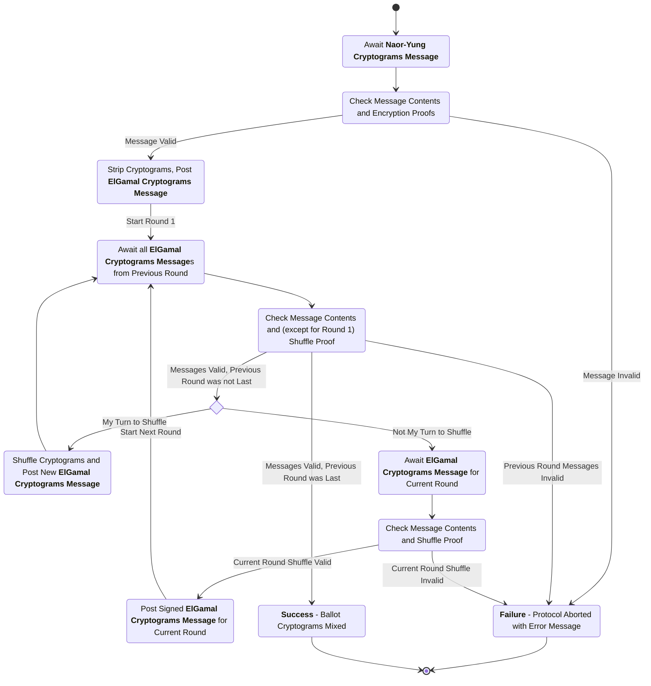
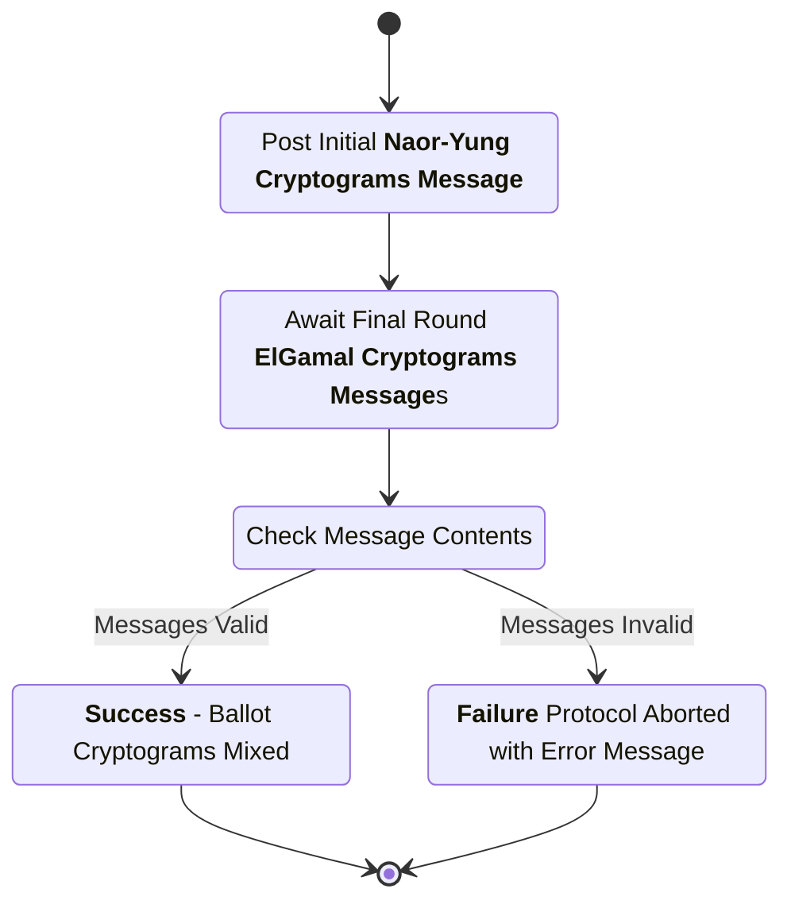

# Trustee Mixing Subprotocol

This subprotocol defines the interactions between the trustees and the trustee administration server (TAS) to accomplish the verified mixing of ballot ciphertexts through the use of a distributed re-encryption mixnet.

## Trustee Protocol Communication

As with the election key generation protocol, the TAS performs minimal computation in this protocol. It performs two main functions: providing a "trustee board" on which the trustees can post protocol messages, and posting an initial message to the trustee board containing the set of encrypted ballots that needs to be mixed.

 It exists to perform two main functions: providing a "trustee board" on which the trustees can post protocol messages, and posting the message to the trustee board containing the initial set of encrypted ballots that needs to be mixed.

More information on the trustee board mechanism is avaiable in the [election key protocol specification](./election-key-gen-spec.md).

This protocol requires the trustees to perform their individual shuffles in an order that is known to all the trustees (so that each trustee knows when it is their turn to shuffle). The mechanism for this ordering is implementation-dependent; possible implementations include lexicographic ordering of the trustee public keys, lexicographic ordering of trustee names, an assignment of numbers to the trustees performed as part of the initial election setup, etc. Here, we will simply assume that such an ordering exists.

Note that the fact that such an ordering exists and the trustees know it implies that the trustees know the entire set of participating trustees, and that the set of participating trustees cannot change _during_ the protocol execution without causing the protocol to fail. The set of participating trustees is provided to all the participating trustees out of band (though the initial protocol message posted by the TAS could also be extended to provide it).

## Phase 1: Post Initial Cryptograms

In this phase of the protocol. the TAS posts the initial list of Naor-Yung cryptograms to the trustee board. Only one message is posted in this phase.

### Mix Initialization Message

sender
: Trustee Administration Server (TAS)

recipient
: All Participating Trustees

board slot
: (`message_type`) (only one `MixInitializationMessage` can be posted to the board)

purpose
: Provide the initial list of Naor-Yung cryptograms that need to be mixed, and the list of trustees that are expected to mix and decrypt them, so that the trustees can verify their encryption proofs and strip them to ElGamal cryptograms for shuffling.

_**structure**_

```rust
struct MixInitializationMsgData {
    originator : TrusteeID,
    signer : TrusteeID,
    election_hash : ElectionHash,
    active_trustees : Vec<TrusteeID>,
    cryptograms : Vec<BallotCryptogram>,
}

struct MixInitializationMsg {
    data : MixInitializationMsgData,
    signature : Signature,
}
```

- `originator`: The trustee ID (name and verifying key) of the TAS that originated this message.
- `signer`: The trustee ID (name and verifying key) of the TAS that signed this message (same as originator for this message type).
- `election_hash`: The hash of the unique election configuration item.
- `active_trustees`: The list of trustees that should participate in the mix and decryption, in the order in which they should participate.
- `cryptograms`: The list of Naor-Yung ballot cryptograms that need to be mixed.
- `data`: The data being signed (contains originator, signer, election hash, active trustees, and cryptograms).
- `signature`: A digital signature created over the serialized contents of the `data` field by the TAS's signing key.

channel properties
: The `signature` is intended to provide integrity and authenticity over the contents of this message.

#### Mix Initialization Message Checks

1. The `election_hash` is the hash of the election configuration item for the current election.
2. The `cryptograms` list contains a list of ballot cryptograms valid for this election, and all of their encryption proofs are valid.
3. The `active_trustees` list contains a list containing at least the threshold number of trustees, all of which are different and all of which are known from the election setup data.
4. The `originator` and `signer` are identical and represent the valid TAS identity.
5. The `signature` is a valid signature matching the `signer.verifying_key` over the serialized contents of the `data` field.

## Phase 2: Trustees Validate Encryption Proofs and Post Stripped Cryptograms

In this phase, all participating trustees examine the initial set of Naor-Yung cryptograms posted by the TAS, performing all the message checks described above. Each one then strips the cryptograms to ElGamal cryptograms for shuffling and posts them to the trustee board. In a correct execution of the protocol, there are `K` (the number of participating trustees) messages posted in this phase, and their contents are identical aside from the `signer` and `signature` fields. Note that the `signer` is included in the content being signed.

Note that the `EGCryptogramsMsg` defined below is the only message type used by the trustees for the remainder of this subprotocol.

### ElGamal (EG) Cryptograms Message

sender
: Participating Trustee

recipient
: All Participating Trustees

board slot
: (`message_type`, `original_message_source`, `public_key`)

purpose
: Post a list of shuffled (or initial, in the case of the first round) ElGamal cryptograms and corresponding shuffle proof (except in the first round).

_**structure**_

```rust
struct EGCryptogramsMsgData {
    originator : TrusteeID,
    signer : TrusteeID,
    election_hash : ElectionHash,
    ciphertexts : BTreeMap<BallotStyle, Vec<StrippedBallotCiphertext>>,
    proofs : BTreeMap<BallotStyle, MixRoundProof>,
}

struct EGCryptogramsMsg {
    data : EGCryptogramsMsgData,
    signature : Signature,
}
```

- `originator`: The trustee ID (name and verifying key) of the trustee (or TAS, in the case of the stripped initial cryptograms) that performed the shuffle to generate the list of ciphertexts and proofs (or the initial posting of the cryptograms) in this message; that is, the protocol actor that first sent the list of ciphertexts and proofs in this message.
- `signer`: The trustee ID (name and verifying key) of the trustee signing this message. Note that if this trustee is sending the message initially, this must be identical to `originator`.
- `election_hash`: The hash of the unique election configuration item.
- `ciphertexts`: A map from ballot styles to lists of shuffled (or stripped initial) stripped ballot ciphertexts.
- `proofs`: A map from ballot styles to mix round proofs corresponding to the `ciphertexts` for that ballot style; these proofs are empty for the message with the stripped initial cryptograms.
- `data`: The data being signed (contains originator, signer, election hash, ciphertexts, and proofs).
- `signature`: A digital signature created over the serialized contents of the `data` field by the signing key corresponding to `signer.verifying_key`.

### ElGamal Cryptograms Message Checks

1. The `election_hash` is the hash of the election configuration item for the current election.
2. The `originator` is the TAS or a trustee participating in this subprotocol, and is not the same as the `originator` from any previous protocol phase.
3. The `ciphertexts` map contains ballot styles and lists of stripped ballot ciphertexts valid for this election.
4. The `ciphertexts` map is identical to the `ciphertexts` map in every other `EGCryptogramsMsg` with the same `originator`.
5. The `proofs` map, for any originator other than the TAS (the source of the stripped initial cryptograms), contains valid mix round proofs for the corresponding `ciphertexts` lists.
6. The `signer` is a valid trustee ID for a trustee participating in this subprotocol.
7. The `signature` is a valid signature matching the `signer.verifying_key` over the serialized contents of the `data` field.

## Phases 3 .. (K + 2): Trustee Mixing and Mix Verification

In each subsequent phase, each trustee performs the `EGCryptogramsMsg` checks described above. One trustee determines (based on the `originator` from the `EGCryptogramsMsg` messages in the previous phase) that it is their turn to shuffle, then shuffles the `ciphertexts` from the previous phase (which were identical across all the messages posted in that phase). Finally, they post an `EGCryptogramsMsg` with the shuffled ciphertexts and the corresponding proofs, using their identity as the `originator` and including their own `signer` identity and corresponding `signature`.

The other trustees, who determined that it was not their turn to shuffle, await the message from the shuffling trustee; when it is posted, each non-shuffling trustee performs all the message checks described above, and if they pass, generates an `EGCryptogramsMsg` with identical contents, but with its own `signer` identity and `signature`, and posts it. Note that the `signer` is always included in the content being signed.

Thus, in each of these phases, `K` messages are posted. In a correct run of the protocol, all `K` messages in the same phase have identical content other than the `signer` and `signature`.

At the end of a successful phase `K + 2`, there are `K` messages with identical content (aside from signing trustee identity and signature) on the trustee board with the last shuffling trustee as the `originator`. When this occurs, the mixing subprotocol is complete. If the messages do not have identical content, the mixing subprotocol fails.

## Protocol Diagrams

Note that, in these diagrams, a trustee "awaits" a message by waiting until the specified message appears on its local copy of the trustee board. Any "await" state can cause the protocol to fail if the message does not arrive within some reasonable amount of time, but these timeouts are not explicitly listed in the state diagram.

## Trustee Process Diagram



## Trustee Administration Server Process Diagram


