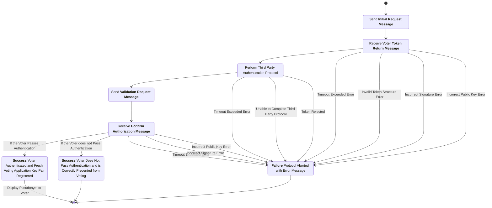
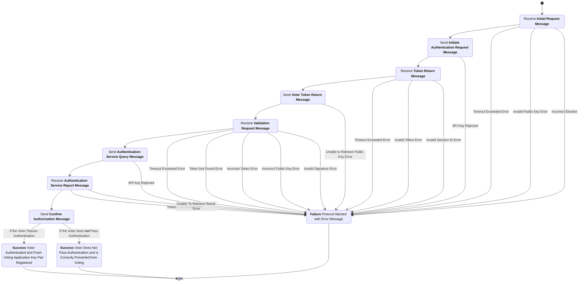

# Voter Authentication Subprotocol

## Phase 1 Initiation

### Initial Request Message

sender
: Voting Application (VA)

recipient
: Election Administration Server (EAS)

purpose
: This message registers the voter's intent to authenticate and associates a freshly generated key-pair with this authentication session.

***structure***

```rust
struct AuthReqMsgData {
  election_hash : ElectionHash,
  voter_verifying_key : VerifyingKey,
}

struct AuthReqMsg {
  data : AuthReqMsgData,
  signature : Signature,
}
```

- `election_hash`: The hash of the unique election configuration item.
- `voter_verifying_key`: The verifying key of a public-private key pair freshly generated by the VA.
- `data`: The data being signed (contains the election hash and voter verifying key).
- `signature`: A digital signature created over the serialized contents of the `data` field, signed by the signing key corresponding to `voter_verifying_key`.

channel properties
: The `election_hash` included in this message serves to prevent replaying of old messages from a different election in the context of this election.

### Initial Request Checks

1. The `election_hash` is the hash of the election configuration item for the current election.

### Initiate Authentication Request Message

sender
: Election Administration Server (EAS)

recipient
: Authentication Service (AS)

purpose
: This message creates the verification session with the third-party authentication session using the credentials of the election administration server.

***structure***

```json
{
    "project_id": "string", // An identifier specific to the voting system infrastructure used by the third-party authentication service to determine the verification flow for the authentication sessions we create.
    "api_key": "string" // The third-party authentication service API key specific to the EAS.
}
```

Note: This structure is specified in JSON reflecting the JSON API of our candidate vendor.

channel properties
: The assumptions for this channel is the security of TLS for connecting to and using the API provided by the authentication service.

### Token Return Message

sender
: Authentication Service (AS)

recipient
: Election Administration Server (EAS)

purpose
: This message returns a token which can be given to the user wishing to authenticate with the authentication service and a session id retained by the server who initiated the request. The session id is later used to query the authentication service for the results of the authentication attempt.

***structure***

```json
{
    "token": "string", // Token to be used by the client to start an authentication session.
    "session_id": "string" // A session identifier to be used by the server to request authentication session information tied to the associated token.
}
```

Note: This structure is specified in JSON reflecting the JSON API of our candidate vendor.

channel properties
: The assumptions for this channel is the security of TLS for connecting to and using the API provided by the authentication service.

### Session Information Storage

The EAS stores the token, session ID, and public key in its database.

***structure***

```rust
// This is data that is written to storage not sent as a message
struct AuthSessionRecord {
  election_hash : ElectionHash,
  voter_verifying_key : VerifyingKey,
  token : String,
  session_id : String,
}
```

- `election_hash`: The hash of the unique election configuration item.
- `voter_verifying_key`: The verifying key from the initial request message.
- `token`: The token from the token return message.
- `session_id`: The session identifier from the token return message.

### Voter Token Return Message

sender
: Election Administration Server (EAS)

recipient
: Voting Application

purpose
: This message communicates the token used to begin an authentication session with the authentication service. The message also confirms which public key the election administration server has associated with this authentication session.

***structure***

```rust
struct HandTokenMsgData {
  election_hash : ElectionHash,
  token : String,
  voter_verifying_key : VerifyingKey,
}

struct HandTokenMsg {
  data : HandTokenMsgData,
  signature : Signature,
}
```

- `election_hash`: The hash of the unique election configuration item.
- `token`: The token from the token return message.
- `voter_verifying_key`: The verifying key from the initial request message.
- `data`: The data being signed (contains the election hash, token, and voter verifying key).
- `signature`: A digital signature created by the EAS's signing key over the serialized contents of the `data` field.

channel properties
: The `signature` is intended to provide *integrity* and *authenticity* over the token and the public key the election administration server has associated it with. Notably, confidentiality is not intended for this channel as the token can only be used to being an authentication session which confidential authentication information is needed to proceed with.

### Voter Token Return Checks

1. The `election_hash` is the hash of the election configuration item for the current election.
2. The `voter_verifying_key` is the voting application's verifying key.
3. The `signature` is a valid signature over the serialized contents of the `data` field signed by the election administration server signing key.

## Phase 2 Third-Party Authentication

The VA and the AS directly send messages back and forth according to the AS protocol. At the end of the process, the AS stores the authentication data of the voter who is using the VA and notifies the VA when the authentication process is complete.

## Phase 3 Validation of Authentication

### Validation Request Message

sender
: Voting Application (VA)

recipient
: Election Administration Server (EAS)

purpose
: This message notifies the election administration server that the third-party authentication step has been completed and the voter is requesting the election administration server connect to the authentication service directly to query the results of the authentication session.

***structure***

```rust
struct AuthFinishMsgData {
  election_hash : ElectionHash,
  token : String,
  public_key : VerifyingKey,
}

struct AuthFinishMsg {
  data : AuthFinishMsgData,
  signature : Signature,
}
```

- `election_hash`: The hash of the unique election configuration item.
- `token`: The token from the token return message.
- `public_key`: The verifying key from the initial request message.
- `data`: The data being signed (contains the election hash, token, and public key).
- `signature`: A digital signature created over the serialized contents of the `data` field, signed by the signing key corresponding to `public_key`.

channel properties
: The `signature` intends to provide *integrity* and *authenticity* over the contents of the message. As the message only contains publicly known data there isn't a need for confidentiality.

### Validation Request Checks

1. The `election_hash` is the hash of the election configuration item for the current election.
2. The `token` matches one `AuthSessionRecord.token`.
3. The `public_key` matches the `AuthSessionRecord.public_key` from check #2.
4. The `signature` is a valid signature over the message contents signed by the `public_key`.

### Validation Request Processing

The EAS retrieves the session ID from storage using the public key which signed the begin validation message. If a session ID is found the *Request Session Data Message* is sent otherwise the *No Session Found Message* is sent.

### Authentication Service Query Message

sender
: Election Administration Server (EAS)

recipient
: Authentication Service (AS)

purpose
: This message requests the authentication data associated with the session ID.

***structure***

```json
{
    "session_id": "string", // The session ID retrieved from EAS storage based on the public key used to sign the Validation Request Message.
    "api_key": "string" // The third-party authentication service API key specific to the EAS.
}
```

Note: This structure is specified in JSON reflecting the JSON API of our candidate vendor.

channel properties
: The assumptions for this channel is the security of TLS for connecting to and using the API provided by the authentication service.

### Authentication Service Report Message

sender
: Authentication Service (AS)

recipient
: Election Administration Server (EAS)

purpose
: This message returns the result of the authentication session from the *Authentication Service Query Message* and the information used in the authentication decision. If the authentication was successful, the authentication service sends its ground truth data concerning the authenticated person.

***structure***

```json
{
  "id": "string",
  "object_name": "verification_session",
  "authenticated": true,
  "authentication_methods": [
    "string"
  ],
  "activated_authentication_methods": [
    "string"
  ],
  "checks": [
    {
      "name": "string",
      "value": true,
      "status": "completed",
      "additional_details": {
        "watchlist_hits": {
          "hits": [
            {
              "entity_type": "person",
              "details": {
                "name": [
                  "string"
                ],
                "alias": [
                  "string"
                ],
                "country": [
                  "string"
                ],
                "address": [
                  {
                    "line1": "string",
                    "line2": "string",
                    "city": "string",
                    "state": "string",
                    "postal_code": "string",
                    "country": "string"
                  }
                ],
                "date_of_birth": [
                  {
                    "day": 0,
                    "month": 0,
                    "year": 0
                  }
                ],
                "date_of_death": [
                  {
                    "day": 0,
                    "month": 0,
                    "year": 0
                  }
                ],
                "place_of_birth": [
                  "string"
                ],
                "gender": [
                  "string"
                ],
                "nationality": [
                  "string"
                ],
                "position": [
                  "string"
                ],
                "passport_number": [
                  "string"
                ],
                "id_number": [
                  "string"
                ],
                "notes": [
                  "string"
                ],
                "created_at": [
                  {
                    "day": 0,
                    "month": 0,
                    "year": 0
                  }
                ],
                "modified_at": [
                  {
                    "day": 0,
                    "month": 0,
                    "year": 0
                  }
                ],
                "source_urls": [
                  "string"
                ]
              },
              "source_lists": [
                {
                  "name": "string",
                  "summary": "string",
                  "url": "string"
                }
              ],
              "hit_types": [
                "sanction"
              ]
            }
          ],
          "updated_at": 0
        }
      },
      "params": {}
    }
  ],
  "completed_at": 0,
  "created_at": 0,
  "email": "string",
  "expires_at": 0,
  "fields_to_collect": [
    "string"
  ],
  "ip": [
    "string"
  ],
  "phone": "string",
  "redirect_url": "string",
  "status": "success",
  "token": "string",
  "updated_at": 0,
  "user_agent": [
    "string"
  ],
  "user_created": false,
  "user_id": "string",
  "traits": {
    "address": {
      "line1": "string",
      "line2": "string",
      "city": "string",
      "state": "string",
      "postal_code": "string",
      "country": "string"
    },
    "dob": {
      "day": 0,
      "month": 0,
      "year": 0
    },
    "email": "string",
    "first_name": "string",
    "last_name": "string",
    "middle_name": "string",
    "second_family_name": "string",
    "full_last_name": "string",
    "phone": "string",
    "ssn4": "string",
    "ssn9": "string",
    "identification_number": "string",
    "identification_type": "string",
    "document": {
      "nationality": "string",
      "document_type": "drivers_license",
      "issuing_country": "string",
      "issuing_subdivision": "string",
      "document_number": "string",
      "date_of_expiry": {
        "day": 0,
        "month": 0,
        "year": 0
      },
      "gender": "string",
      "address": {
        "line1": "string",
        "line2": "string",
        "city": "string",
        "state": "string",
        "postal_code": "string",
        "country": "string"
      },
      "date_of_birth": {
        "day": 0,
        "month": 0,
        "year": 0
      },
      "first_name": "string",
      "last_name": "string",
      "middle_name": "string"
    },
    "document_front": "string",
    "document_back": "string",
    "face_scan_preview": "string"
  },
  "project_id": "string",
  "custom_fields": {}
}
```

Note: This structure is specified in JSON reflecting the JSON API of our candidate vendor.

channel properties
: The assumptions for this channel is the security of TLS for connecting to and using the API provided by the authentication service.

## Phase 4 Voter Authorization

### Authorization Checks

1. Biographical information from the *Authentication Service Report Message* match a registered voter in the voter registration database.
2. The `token` in the *Authentication Service Report Message* matches one `AuthSessionRecord.token`.

### Authorize Voter Message

sender
: Election Administration Server (EAS)

recipient
: Digital Ballot Box (DBB)

purpose
: This message is sent from the election administration server to the digital ballot box  authorizing the acceptance of ballot submission and ballot casting messages signed by the `voter_verifying_key` representing votes from the voter with pseudonym `voter_pseudonym`. This authorization will be stored in a table in the digital ballot box keyed by `voter_pseudonym`.

***structure***

```rust
struct AuthVoterMsgData {
  election_hash : ElectionHash,
  voter_pseudonym : VoterPseudonym,
  voter_verifying_key : VerifyingKey,
  ballot_style : BallotStyle,
}

struct AuthVoterMsg {
  data : AuthVoterMsgData,
  signature : Signature,
}
```

- `election_hash`: The hash of the unique election configuration item.
- `voter_pseudonym`: The unique identifier for the voter retrieved from the EAS voter registration database.
- `voter_verifying_key`: The verifying key from the initial request message.
- `ballot_style`: The ballot style this voter is authorized to cast, retrieved from the EAS voter registration database and the election manifest.
- `data`: The data being signed (contains the election hash, voter pseudonym, voter verifying key, and ballot style).
- `signature`: A digital signature created by the EAS's signing key over the serialized contents of the `data` field.

channel properties
: The signature by the Election Administration Server is intended to provide *integrity* over the contents of the message and *authentication* for the digital ballot box.

### Authorize Voter Checks

1. The `election_hash` is the hash of the election configuration item for the current election.
2. The `voter_pseudonym` is present and a well formed identifier.
3. The `voter_verifying_key` is present and a well formed verifying key from a supported cryptosystem.
4. The `ballot_style` is a valid ballot style for this election.
5. The `signature` is a valid signature over the serialized contents of the `data` field signed by the election administration server signing key.

### Confirm Authorization Message

sender
: Election Administration Server (EAS)

recipient
: Voting Application

purpose
: This message copies the message authorizing the public key for voting and sends it to the voter confirming they are authorized to vote. This message also informs the voter of their officially registered ballot style.

***structure***

```rust
struct ConfirmAuthorizationMsgData {
  election_hash : ElectionHash,
  voter_pseudonym : Option<VoterPseudonym>,
  voter_verifying_key : VerifyingKey,
  ballot_style : Option<BallotStyle>,
  authentication_result : (bool, String),
}

struct ConfirmAuthorizationMsg {
  data : ConfirmAuthorizationMsgData,
  signature : Signature,
}
```

- `election_hash`: The hash of the unique election configuration item.
- `voter_pseudonym`: The optional unique identifier for the voter retrieved from the EAS voter registration database (present only if authentication succeeded).
- `voter_verifying_key`: The verifying key from the initial request message.
- `ballot_style`: The optional ballot style this voter is authorized to cast, retrieved from the EAS voter registration database and the election manifest (present only if authentication succeeded).
- `authentication_result`: A tuple containing a boolean indicating if the voter was authenticated by the authentication service and if they are registered to vote in this election, and a string with result details.
- `data`: The data being signed (contains all the above fields).
- `signature`: A digital signature created by the EAS's signing key over the serialized contents of the `data` field.

channel properties
: The signature by the Election Administration Server is intended to provide *integrity* over the contents of the message and *authentication* for the voting application.

### Confirm Authorization Checks

1. The `election_hash` is the hash of the election configuration item for the current election.
2. If `voter_pseudonym` is present, it is a well formed identifier.
3. The `voter_verifying_key` is the voting application's verifying key.
4. If `ballot_style` is present, it is a valid ballot style for this election.
5. The `signature` is a valid signature over the serialized contents of the `data` field signed by the election administration server signing key.

## Voting Application Process Diagram



## Election Administration Server Process Diagram


